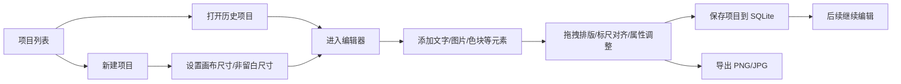

## 1. 产品概述

本系统定位为一个**面向装修/广告物料场景的网页版轻量设计编辑器**，产品形态更接近“网页版 Photoshop / Canva / Figma 中的画布编辑模块”，而不是以 AI 生图为核心的工作台。

系统主要用于创建和编辑保护垫、空间标识、施工提示牌等平面设计稿，支持用户创建项目、保存历史项目、再次打开继续编辑，并最终导出成品图片用于印刷或交付。

- **目标用户**：装修公司设计师、空间设计师、门店物料设计人员、施工物料制作人员
- **核心价值**：
  - 让用户通过浏览器直接完成基础平面排版与版式设计
  - 支持历史项目持续编辑，降低重复制作成本
  - 聚焦“尺寸明确、元素拖拽、对齐方便、导出直接可用”的业务场景
- **数据存储建议**：优先采用 **SQLite** 存储项目元数据、画布配置、元素结构和历史项目记录
- **AI 使用判断**：当前阶段核心功能**不依赖大模型**，属于标准画布编辑/排版能力；后续如增加“智能抠图、智能扩图、智能生成素材”等能力，再考虑引入 AI 模块

---

## 2. 产品定位与范围调整

### 2.1 当前版本定位

当前版本应聚焦为：

1. **项目化管理的在线画布编辑器**
2. **支持尺寸标注和排版的设计工作台**
3. **支持导出图片的轻量印刷/制作稿编辑系统**

### 2.2 当前版本不作为重点的能力

以下能力不应作为本阶段核心需求：

- 不以大模型文生图/图生图为主流程
- 不优先建设复杂的 AI 提示词系统
- 不优先建设高复杂度的素材审核/训练能力
- 不优先实现专业 Photoshop 级别的图层混合、滤镜、通道、蒙版体系

### 2.3 典型业务场景

1. 用户新建一个保护垫设计项目
2. 设置成品尺寸、非留白尺寸、背景颜色
3. 在画布上添加 Logo、说明文字、电话、警示语、色块、边框、图片等元素
4. 通过拖拽、缩放、对齐线、标尺线进行布局调整
5. 保存为项目，后续可以再次打开继续编辑
6. 最终导出 PNG / JPG 成品图，用于生产或交付预览

---

## 3. 核心功能需求

### 3.1 用户角色

| 角色 | 说明 | 核心权限 |
|------|------|----------|
| 设计用户 | 本地或内部使用人员 | 新建项目、编辑画布、保存项目、导出图片 |
| 管理员（可选） | 管理素材和模板的内部人员 | 管理公共模板、公共素材、项目配置 |

> 现阶段可先按**单用户/内部系统**设计，不强依赖复杂账号体系。

### 3.2 功能模块

1. **项目管理**
   - 新建项目
   - 查看历史项目
   - 打开项目继续编辑
   - 重命名/删除项目
   - 自动保存 / 手动保存

2. **画布编辑器**
   - 设置画布尺寸
   - 设置非留白尺寸并在画布上可视化展示
   - 设置画布背景色
   - 添加/编辑文字
   - 添加/编辑图片
   - 元素拖拽、缩放、旋转、对齐
   - 标尺与辅助线显示
   - 图层顺序调整

3. **样式与属性面板**
   - 字体选择
   - 字号设置
   - 字体颜色设置
   - 加粗/对齐/字间距等基础排版能力
   - 图片尺寸、位置、透明度等基础属性

4. **导出能力**
   - 导出 PNG
   - 导出 JPG
   - 按原始画布尺寸导出
   - 可选导出预览图

5. **素材与模板（建议）**
   - 上传本地图片到画布
   - 预置常用模板
   - 预置常用文案/标识区块

### 3.3 页面级功能说明

| 页面名称 | 模块名称 | 功能说明 |
|----------|----------|----------|
| 首页/项目页 | 项目列表 | 展示历史项目、最近编辑时间、缩略图 |
| 首页/项目页 | 新建项目 | 输入项目名称、选择默认尺寸或自定义尺寸 |
| 首页/项目页 | 项目操作 | 打开、复制、重命名、删除项目 |
| 编辑器页 | 主画布区域 | 占页面绝大部分，用于实时设计和拖拽编辑 |
| 编辑器页 | 顶部工具栏 | 保存、撤销、重做、缩放、导出 |
| 编辑器页 | 左/右侧工具栏 | 添加文字、图片、形状、标尺、尺寸设置等 |
| 编辑器页 | 属性面板 | 根据当前选中元素展示对应属性设置 |
| 编辑器页 | 标尺与辅助线 | 辅助元素对齐和尺寸控制 |
| 编辑器页 | 尺寸标注层 | 显示成品尺寸、非留白尺寸等业务标注 |

---

## 4. 核心业务流程

用户进入系统 → 查看历史项目或新建项目 → 设置画布尺寸 → 进入编辑器 → 添加文字/图片/色块等元素 → 拖拽排版并通过标尺/辅助线对齐 → 保存项目 → 后续再次打开继续编辑 → 导出成品图片



---

## 5. 编辑器详细需求

### 5.1 画布能力

- 画布区域应占据页面主要空间，保证设计编辑效率
- 支持自定义宽高（单位建议支持 px / cm，内部统一换算）
- 支持显示实际成品边界
- 支持显示“非留白尺寸”边界，并在画布上方/侧边进行尺寸标注
- 支持背景颜色设置
- 支持缩放查看、居中适配、100% 显示

### 5.2 元素能力

#### 文字元素
- 添加单行/多行文字
- 设置字体、字号、颜色、加粗、对齐方式
- 支持拖拽移动
- 支持缩放和旋转（旋转可作为次优先级）

#### 图片元素
- 上传本地图片并放入画布
- 支持拖拽移动、缩放
- 支持层级调整
- 后续可扩展裁剪、抠图、透明背景处理

#### 基础图形元素
- 支持色块、矩形、线条
- 用于制作底色条、边框、分隔线、警示色块等

### 5.3 对齐与辅助能力

- 显示顶部/左侧标尺
- 支持拖出辅助线
- 元素移动时显示吸附线/对齐线
- 支持与画布中心线、边缘线、其他元素边缘对齐
- 支持展示关键业务尺寸，如总宽、有效宽、总高、有效高

### 5.4 图层与选择能力

- 支持单选元素
- 支持基础图层顺序：置顶、置底、上移一层、下移一层
- 支持删除元素
- 支持复制元素（建议）

### 5.5 保存与恢复

- 项目保存时需存储：
  - 项目基本信息（名称、时间、缩略图）
  - 画布配置（宽高、背景色、非留白尺寸、单位）
  - 元素列表（类型、位置、尺寸、样式、内容、层级）
- 打开历史项目时应恢复完整编辑状态
- 建议支持自动保存，降低误操作风险

---

## 6. 数据设计建议（SQLite）

### 6.1 数据库选型建议

使用 **SQLite** 作为当前阶段存储方案，原因如下：

- 部署简单，适合单体应用或轻量后台
- 对项目配置、画布 JSON、历史记录存储足够
- 开发成本低，便于快速验证产品

### 6.2 建议表结构

#### projects
- id
- name
- thumbnail
- width
- height
- unit
- background_color
- bleedless_width（非留白宽）
- bleedless_height（非留白高）
- canvas_data（JSON，存储元素结构）
- created_at
- updated_at

#### assets（可选）
- id
- name
- type
- path
- created_at

#### templates（可选）
- id
- name
- preview
- template_data（JSON）
- created_at

### 6.3 画布数据结构建议

建议使用 JSON 结构保存整个画布状态，例如：

```json
{
  "canvas": {
    "width": 1200,
    "height": 700,
    "unit": "cm",
    "backgroundColor": "#FFFFFF",
    "safeArea": {
      "width": 840,
      "height": 400
    }
  },
  "elements": [
    {
      "id": "txt_001",
      "type": "text",
      "x": 320,
      "y": 180,
      "text": "爱家空间设计",
      "fontFamily": "Microsoft YaHei",
      "fontSize": 64,
      "fill": "#FF0000",
      "zIndex": 2
    },
    {
      "id": "img_001",
      "type": "image",
      "x": 160,
      "y": 160,
      "width": 120,
      "height": 120,
      "src": "...",
      "zIndex": 1
    }
  ]
}
```

---

## 7. 界面设计建议

### 7.1 页面布局

推荐采用典型在线设计器布局：

- **顶部工具栏**：项目名、保存、撤销、重做、缩放、导出
- **左侧工具栏**：文字、图片、形状、模板、辅助线、尺寸设置
- **中间主区域**：大画布工作区（页面主要可视区域）
- **右侧属性栏**：当前选中元素的属性编辑

### 7.2 视觉风格建议

- 整体风格偏专业工具型，而非营销展示型
- 背景可采用浅灰工作区，白色画布居中显示
- 工具栏简洁清晰，强调效率与可读性
- 标尺、尺寸线、对齐辅助线使用低干扰但清晰可见的颜色

### 7.3 参考图映射说明

结合你提供的参考图，系统应重点支持：

- 顶部总宽尺寸标注（如 120CM）
- 内部有效内容宽度标注（如 84CM）
- 左右/上下方向尺寸辅助展示
- 红色文字、Logo、色块的自由排版
- 底部免责声明和色卡区域排版

也就是说，该系统不是单纯“贴图生成器”，而是一个**带业务尺寸意识的排版编辑器**。

---

## 8. 技术方案与开源能力分析

### 8.1 是否需要大模型

结论：**当前这批功能基本不需要大模型**。

原因：

- 画布创建、元素拖拽、标尺、导出都属于成熟的前端编辑器能力
- 项目保存/恢复属于常规数据持久化需求
- 文字、图片、图形排版本质上是 2D Canvas / SVG 编辑场景

只有在以下扩展能力中，AI 才可能有明显价值：

- 图片智能抠图
- 自动去背景
- 智能生成文案版式
- 根据描述自动生成设计稿初稿

### 8.2 可优先考虑的开源组件/技术

#### 方案 A：Fabric.js

适合度：**高**

优点：
- 专注 2D 画布编辑
- 对文字、图片、矩形、线条、拖拽缩放支持成熟
- 导出图片方便
- 社区资料多，上手快

适用场景：
- 当前这种“在线排版 + 项目保存 + 导出图片”的需求非常匹配

#### 方案 B：Konva.js / React Konva

适合度：**高**

优点：
- 对 React 集成友好
- 节点模型清晰，适合做编辑器
- 拖拽、变换、选中框、图层处理较方便

适用场景：
- 如果当前前端是 React，优先级可以和 Fabric.js 接近

#### 方案 C：tldraw / Excalidraw

适合度：**中**

优点：
- 开箱即用，交互成熟

限制：
- 更偏白板/绘图，不完全适合“印刷排版 + 尺寸标注 + 精细属性编辑”场景
- 深度业务改造成本可能较高

#### 方案 D：Polotno

适合度：**较高（需评估许可和二次开发成本）**

优点：
- 本身就是在线设计编辑器方向
- 与 Canva 类产品形态接近
- 具备较成熟的编辑器能力

限制：
- 需要评估商业许可、生态依赖和可控性

### 8.3 推荐技术路线

若目标是**尽快完成可用版本**，建议优先考虑：

1. **前端画布层：React + Konva（或 Fabric.js）**
2. **后端/API：Node.js + SQLite**
3. **数据结构：项目主表 + 画布 JSON**
4. **导出策略：前端直接导出 PNG/JPG，必要时后端补充高分辨率导出**

其中：

- 如果更看重 React 组件化和状态管理整合，优先 **React Konva**
- 如果更看重传统画布编辑能力与成熟案例，优先 **Fabric.js**

---

## 9. 分阶段建设建议

### 9.1 第一阶段（MVP）

目标：先做出“可创建项目、可编辑、可保存、可导出”的可用版本

包含：

- 项目列表
- 新建项目
- 画布尺寸设置
- 非留白尺寸显示
- 添加文字
- 添加图片
- 设置字体/字号/颜色
- 拖拽、缩放
- 标尺/基础辅助线
- 保存项目到 SQLite
- 导出 PNG/JPG

### 9.2 第二阶段

- 模板系统
- 常用素材库
- 更多图形元素
- 图层面板
- 自动保存与版本记录
- 更完整的对齐吸附能力

### 9.3 第三阶段（AI 扩展）

- 智能抠图
- 图片背景去除
- AI 辅助排版建议
- 文案自动生成

---

## 10. 成功标准

本次需求调整后的产品成功标准如下：

1. 用户能够创建一个新项目并进入画布编辑器
2. 用户能够设置画布尺寸与非留白尺寸
3. 用户能够在画布上添加文字、图片、色块，并自由拖拽调整
4. 用户能够看到标尺/辅助尺寸信息，便于对齐和制作
5. 用户能够保存项目，并在后续重新打开继续编辑
6. 用户能够导出最终成品图片
7. 当前方案在无大模型参与的情况下即可落地实现

---

## 11. 结论

该系统应从“AI 生图工具”调整为“**面向装修物料场景的在线画布设计编辑器**”。

从实现角度看，这是一类成熟的前端编辑器产品，不必在第一阶段引入大模型。优先基于现成画布引擎（如 **Fabric.js / React Konva**）和 **SQLite** 做项目化存储，能够较快完成一个可用版本。后续如确有抠图、智能生成等诉求，再将 AI 作为增强模块接入即可。