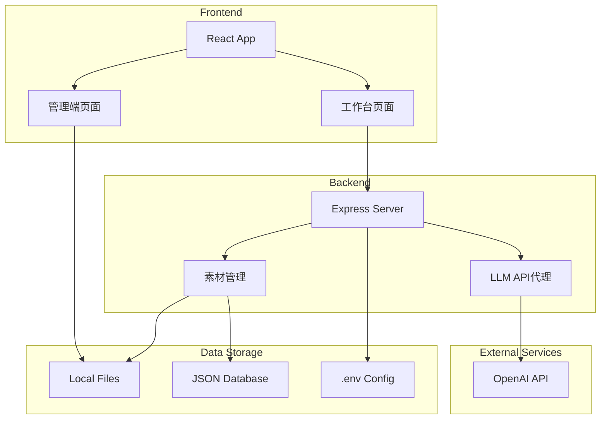
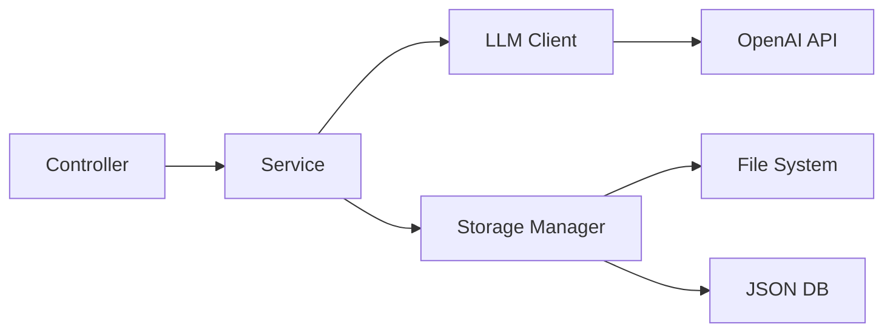
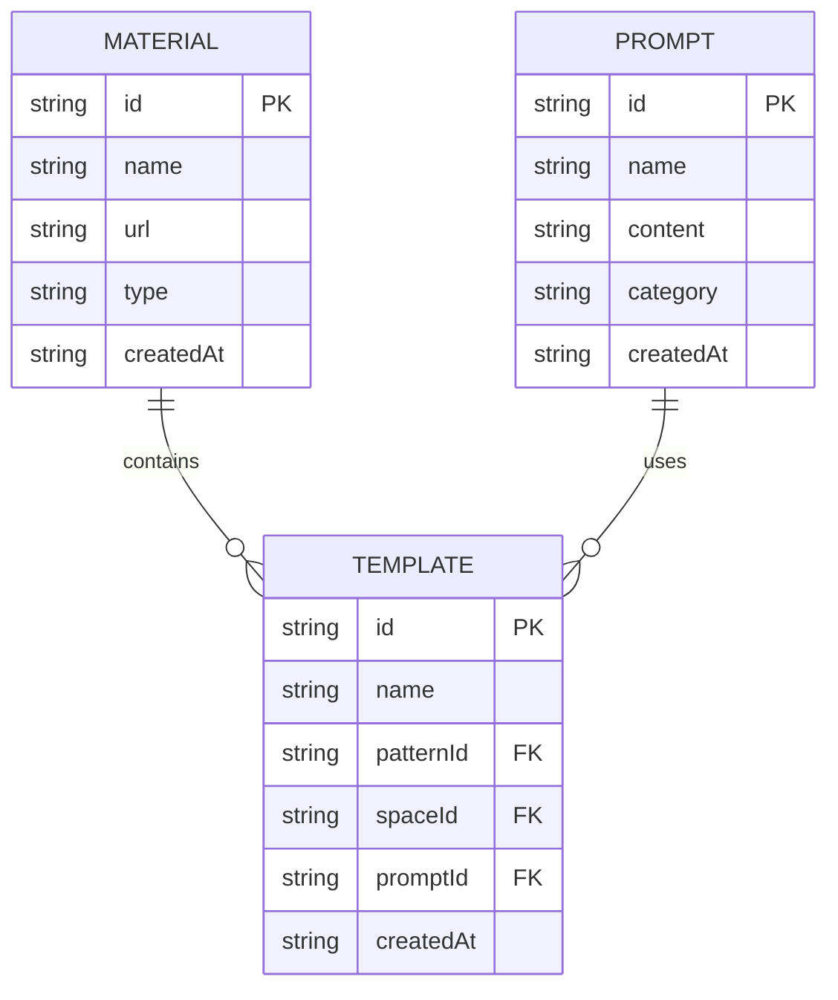

## 1. Architecture Design


## 2. Technology Description
- Frontend: React@18 + tailwindcss@3 + vite + TypeScript
- Initialization Tool: vite-init (react-ts template)
- Backend: Express@4 + TypeScript
- Database: Local JSON files (素材数据)
- Storage: Local file system (图片素材)
- External API: OpenAI DALL-E API

## 3. Route Definitions
| Route | Purpose |
|-------|---------|
| / | 工作台页面 (默认) |
| /admin | 管理端页面 |

## 4. API Definitions

### 4.1 生成图片 API
**POST /api/generate**
- Request:
```typescript
interface GenerateRequest {
  templateId: string;
  prompt: string;
  patternImage: string; // base64 or URL
  spaceImage: string; // base64 or URL
  aspectRatio?: "1:1" | "16:9" | "9:16";
}
```
- Response:
```typescript
interface GenerateResponse {
  success: boolean;
  imageUrl?: string;
  error?: string;
}
```

### 4.2 获取素材列表 API
**GET /api/materials**
- Response:
```typescript
interface MaterialsResponse {
  patterns: MaterialItem[];
  spaces: MaterialItem[];
}

interface MaterialItem {
  id: string;
  name: string;
  url: string;
  type: "pattern" | "space";
  createdAt: string;
}
```

### 4.3 上传素材 API
**POST /api/materials/upload**
- Request: Multipart/form-data
  - file: 图片文件
  - type: "pattern" | "space"
  - name: 素材名称

### 4.4 获取提示词列表 API
**GET /api/prompts**
- Response:
```typescript
interface PromptsResponse {
  prompts: PromptItem[];
}

interface PromptItem {
  id: string;
  name: string;
  content: string;
  category: string;
}
```

### 4.5 保存提示词 API
**POST /api/prompts**
- Request:
```typescript
interface SavePromptRequest {
  id?: string;
  name: string;
  content: string;
  category: string;
}
```

## 5. Server Architecture Diagram


## 6. Data Model

### 6.1 Data Model Definition


### 6.2 Data Definition Language
```sql
-- materials.json (JSON格式存储)
-- 结构:
-- {
--   "patterns": [{ "id": "...", "name": "...", "url": "...", "createdAt": "..." }],
--   "spaces": [{ "id": "...", "name": "...", "url": "...", "createdAt": "..." }]
-- }

-- prompts.json (JSON格式存储)
-- 结构:
-- [{ "id": "...", "name": "...", "content": "...", "category": "...", "createdAt": "..." }]

-- templates.json (JSON格式存储)
-- 结构:
-- [{ "id": "...", "name": "...", "patternId": "...", "spaceId": "...", "promptId": "...", "createdAt": "..." }]
```

## 7. Environment Configuration
```env
# .env 文件
OPENAI_API_KEY=your-api-key
OPENAI_API_BASE_URL=https://api.openai.com/v1
PORT=5173
UPLOAD_DIR=./uploads
```